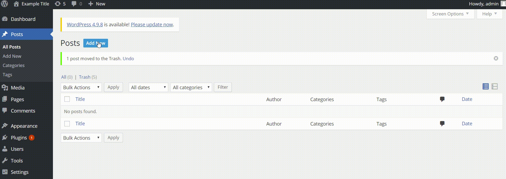
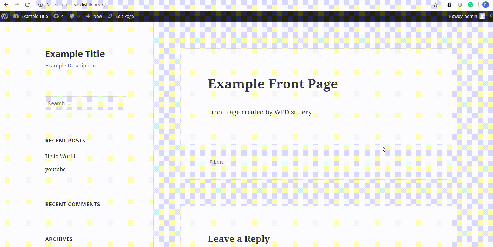
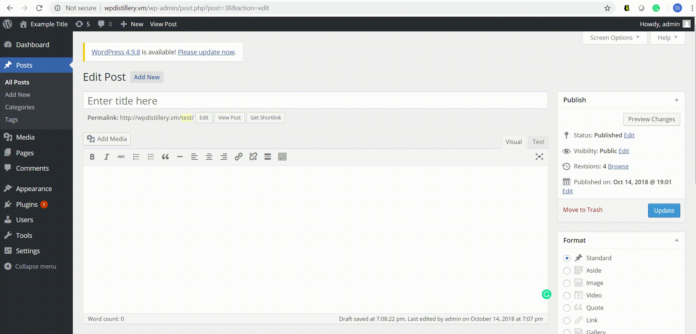
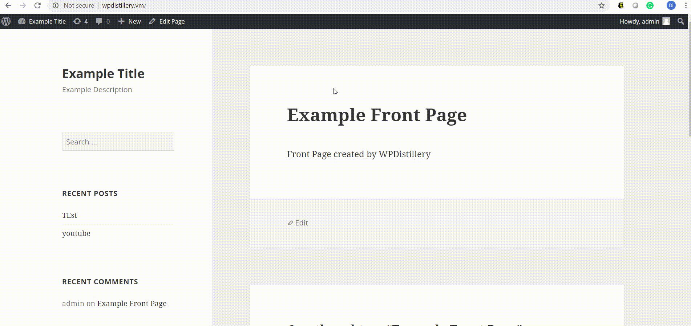

# Project 7 - WordPress Pentesting

Time spent: **10** hours spent in total

> Objective: Find, analyze, recreate, and document **five vulnerabilities** affecting an old version of WordPress

## Pentesting Report

1. (Required) WordPress 4.0-4.7.2- Authenticated Stored Cross-Site Scripting (XSS) in YouTube URL Embeds
  - [ ] Summary: 
    - Vulnerability types: XSS
    - Tested in version: 4.2
    - Fixed in version: 4.2.13
  - [ ] GIF Walkthrough: 
  - [ ] Steps to recreate: 
        [embed src='https://youtube.com/embed/12345\x3csvg onload=alert(1)\x3e'][/embed]
  - [ ] Affected source code:https://github.com/WordPress/WordPress/commit/419c8d97ce8df7d5004ee0b566bc5e095f0a6ca8
    - [Link 1](https://github.com/WordPress/WordPress/commit/419c8d97ce8df7d5004ee0b566bc5e095f0a6ca8)
  - [ ] Reference: https://blog.sucuri.net/2017/03/stored-xss-in-wordpress-core.html
  
  
2. (Required) WordPress <= 4.2.3 - Legacy Theme Preview Cross-Site Scripting (XSS)
  - [ ] Summary: 
    - Vulnerability types:XSS
    - Tested in version: 4.2 
    - Fixed in version: 4.2.4
  - [ ] GIF Walkthrough: 
  - [ ] Steps to recreate: 
         <a href='/wp-admin/' title="" style="position:absolute;top:0;left:0;width:100%;height:100%;display:block;" onmouseover=alert(1)//'>Test</a>
  - [ ] Affected source code:
    - [Link 1](https://core.trac.wordpress.org/changeset/33549)
  - [ ] Reference: https://blog.sucuri.net/2015/08/persistent-xss-vulnerability-in-wordpress-explained.html
  
  
3. (Required) WordPress 3.6.0-4.7.2 - Authenticated Cross-Site Scripting (XSS) via Media File Metadata
  - [ ] Summary: 
    - Vulnerability types:XSS
    - Tested in version: 4.2 
    - Fixed in version: 4.2.13
  - [ ] GIF Walkthrough:  
  - [ ] Steps to recreate: 
  - [ ] Affected source code:
    - [Link 1](https://github.com/WordPress/WordPress/commit/28f838ca3ee205b6f39cd2bf23eb4e5f52796bd7)
  - [ ] Reference: http://seclists.org/oss-sec/2017/q1/563
  
  
4. (Optional) WordPress 2.9-4.7 - Authenticated Cross-Site scripting (XSS) in update-core.php
  - [ ] Summary: 
    - Vulnerability types: XSS
    - Tested in version: 4.2 
    - Fixed in version:  4.2.11
  - [ ] GIF Walkthrough: 
  - [ ] Steps to recreate: 
  - [ ] Affected source code:
    - [Link 1](https://github.com/WordPress/WordPress/blob/c9ea1de1441bb3bda133bf72d513ca9de66566c2/wp-admin/update-core.php)
5. (Optional) WordPress <= 4.2 - Unauthenticated Stored Cross-Site Scripting (XSS)
  - [ ] Summary: 
    - Vulnerability types: XSS
    - Tested in version: 4.2
    - Fixed in version: 4.2.1
  - [ ] GIF Walkthrough:  
  - [ ] Steps to recreate: 
      
  - [ ] Affected source code: Not specified source code. 
  - [ ] Reference:https://klikki.fi/adv/wordpress2.html

## Assets

List any additional assets, such as scripts or files

## Resources

- [WordPress Source Browser](https://core.trac.wordpress.org/browser/)
- [WordPress Developer Reference](https://developer.wordpress.org/reference/)

GIFs created with [LiceCap](http://www.cockos.com/licecap/).

## Notes

Describe any challenges encountered while doing the work

## License

    Copyright [2018] [Di Sun]

    Licensed under the Apache License, Version 2.0 (the "License");
    you may not use this file except in compliance with the License.
    You may obtain a copy of the License at

        http://www.apache.org/licenses/LICENSE-2.0

    Unless required by applicable law or agreed to in writing, software
    distributed under the License is distributed on an "AS IS" BASIS,
    WITHOUT WARRANTIES OR CONDITIONS OF ANY KIND, either express or implied.
    See the License for the specific language governing permissions and
    limitations under the License.
